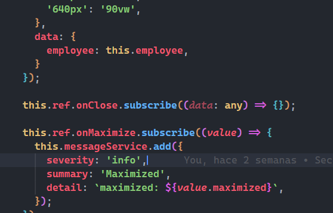

Tengo la siguiente estructura 

Application : Cadi Front 

src: { 
   app : {
      core: {
         models,
         guards,
         services
      },
      pages: {
         admin: {
            dashboard,
            departament,
            licenses,
            vacations,
            hoursWorked,
            testPerformace,
            employees,
            settings,
            search,
            admin.routes.ts
         },
         auth: {
            login,
            register,
            auth.routes.ts
         },
         landingPage
      },
      shared: {
         components: {
            sidebar,
            navBar,
         }
      }
   },
   enviroments: {
      enviroments.ts
      enviroments.develoment.ts
   }
}

Recomendacion 

Application : Cadi Front 

src: { 
    app: {
        core: {
            models,
            guards,
            services: {
                shared,
                admin,
                auth
            },
            utils
        },
        pages: {
            admin: {
                dashboard,
                departament,
                licenses,
                vacations,
                hoursWorked,
                testPerformance,
                employees,
                settings,
                search,
                routes: {
                    admin.routes.ts
                }
            },
            auth: {
                login,
                register,
                routes: {
                    auth.routes.ts
                }
            },
            landingPage
        },
        shared: {
            components: {
                layout, // Para sidebar, navBar, etc.
                widgets // Otros componentes reutilizables
            },
            shared.module.ts
        }
    },
    enviroments: {
        enviroments.ts,
        enviroments.development.ts
    },
    assets: {
        images,
        fonts
    },
    styles: {
        global.scss,
        variables.scss
    }
}

Nota importante revisar esta porcion de codigo  por si hay algo de emmiters en las dialog de prime ng

Pendientes Modelo Empleados
 -Revisar por que se cierra simultaneamente la ventana de editar con la de detalles
 -Agregar el delete de empleados